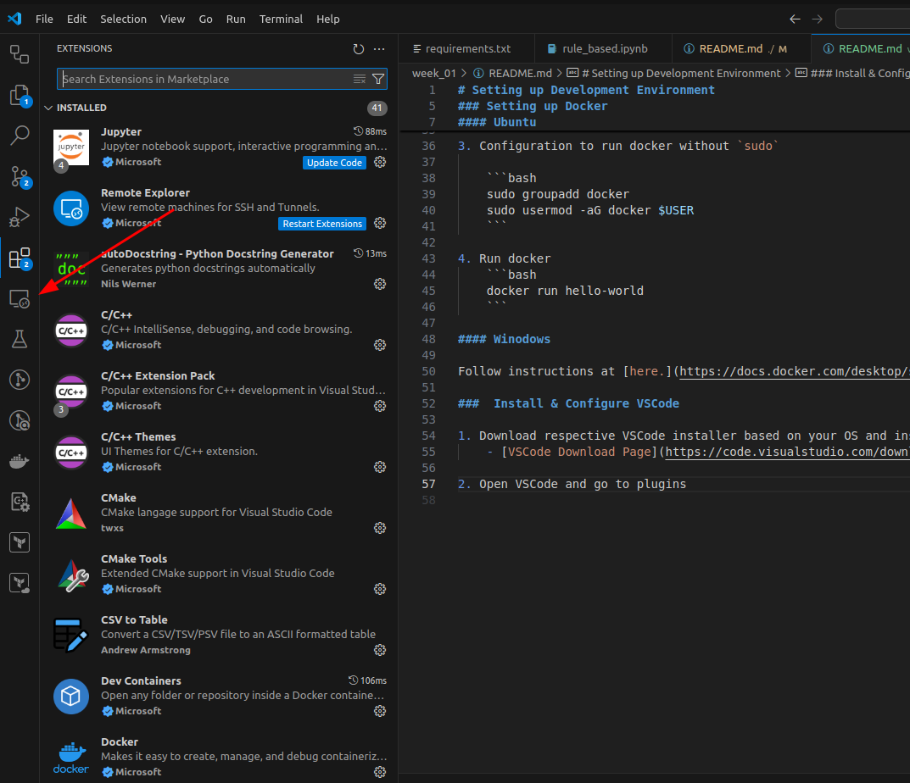

# Setting up Development Environment

Follow the instructions to setup local development environment for the practials of the course module.

### Setting up Docker

#### Ubuntu

Follow the instructions here: [install-using-the-repository](https://docs.docker.com/engine/install/ubuntu/#install-using-the-repository)


1. Setup up Docker's apt registry

    ```bash
    # Add Docker's official GPG key:
    sudo apt-get update
    sudo apt-get install ca-certificates curl
    sudo install -m 0755 -d /etc/apt/keyrings
    sudo curl -fsSL https://download.docker.com/linux/ubuntu/gpg -o /etc/apt/keyrings/docker.asc
    sudo chmod a+r /etc/apt/keyrings/docker.asc

    # Add the repository to Apt sources:
    echo \
    "deb [arch=$(dpkg --print-architecture) signed-by=/etc/apt/keyrings/docker.asc] https://download.docker.com/linux/ubuntu \
    $(. /etc/os-release && echo "$VERSION_CODENAME") stable" | \
    sudo tee /etc/apt/sources.list.d/docker.list > /dev/null
    sudo apt-get update
    ```

2. Install the Docker packages.

    ```bash
    sudo apt-get install docker-ce docker-ce-cli containerd.io docker-buildx-plugin docker-compose-plugin
    ```

3. Configuration to run docker without `sudo`

    ```bash
    sudo groupadd docker
    sudo usermod -aG docker $USER
    ```

4. Run docker
    ```bash
    docker run hello-world
    ```

#### Winodows

Follow instructions at [here.](https://docs.docker.com/desktop/setup/install/windows-install/)

###  Install & Configure VSCode

1. Download respective VSCode installer based on your OS and install it.
    - [VSCode Download Page](https://code.visualstudio.com/download)

2. Open VSCode and go to plugins 

    

3. Install below plugins
    - `ms-azuretools.vscode-docker`
    - `ms-vscode-remote.remote-containers`
    - `ms-python.python`


### Clone and Open Course Repository in VSCode

1. If git is not available on your local system, follow the instructions in respective installation page.
    - [Ubuntu Installation](https://git-scm.com/downloads/linux)
    - [Windows Installstion](https://git-scm.com/downloads/win)

2. Clone github repo,
    ```bash
    git clone https://github.com/Mathanraj-Sharma/intro-to-ml-sjp.git
    ```

3. Enter into repo and open
    ```bash
    cd ./intro-to-ml-sjp
    code .
    ```

4. Since we prefer linux environment for this practicals, we have to reopen the code in Ubuntu devcontainer. (container configuration is already given at `.devcontainer.json` at repo root)
    - Open command pallate in VSCode (`Ctrl + Shift + P`)
    - Select `Dev Containers: Reopen in Container` 


### Install miniforge3

Here we will use miniforge3, since I would like to use mamba which is a faster dependency resolver compare to conda. 

```bash
wget "https://github.com/conda-forge/miniforge/releases/latest/download/Miniforge3-$(uname)-$(uname -m).sh"

bash Miniforge3-$(uname)-$(uname -m).sh -b

mamba shell init

mamba config set auto_activate_base false
```
